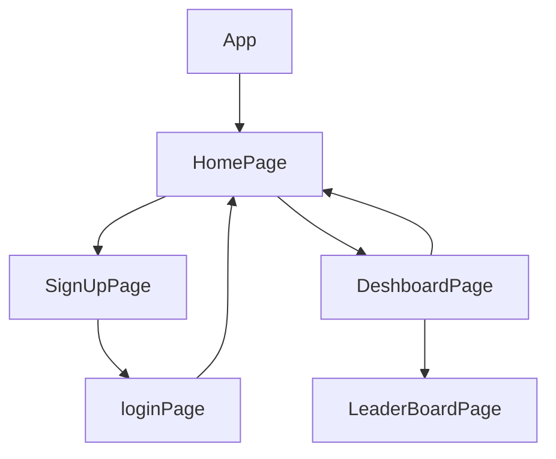

> 💻 PROJECT NAME ✨ => 🌙SOCIAL MEDIA APP🎮
> 
 

---

## 🔗 Collaborators Profile Links✨

| Made By | Github                                                                                                                                   | Linkedin                                                                                                                                                            | Portfolio                                                                                                                                    |
| ------------- | ---------------------------------------------------------------------------------------------------------------------------------------- | ------------------------------------------------------------------------------------------------------------------------------------------------------------------- | -------------------------------------------------------------------------------------------------------------------------------------------- |
| Prince Singh | |  | | 

 

---
## 💫Tech-Stack->

- #### For Frontend :-
   - `HTML5`
  - `CSS3`
  - `JavaScript `
   - `Redux`
  - `ReactJS`
   - `ES6 `

- #### For Backend :-
   - `NodeJS`
   - `ExpressJS`
    - `MongoDB `
- #### For deploy database :- 
    
     - `Vercel`
   

- #### For Styling :-  
   - `Chakra UI `
   

- #### For live Project : -
   - `Vercel`

 ## ⭕Steps to run my Project:

✨Clone the repository.

✨Run the command `npm install` in the frontend.

✨Run the command `npm run dev` in the backend.

✨Run the command `npm start` in the frontend folder run on localhost:3000.
---

---
## Features ✨:-
---
 | Serial No            | Feature                                                              |
| ----------------- | ------------------------------------------------------------------ |
| 1 | Can create User |
| 2 | User can view edit , delete and create new Post |
| 3 | user can view total number of post , most liked post and can update user details |

---
# Package.json(Dependency)✨:-

 | Serial No            | Backend                      |  Frontend      |
| ----------------- | -------------------|------------------------ |
| 1 | mongoose |   Chakra-ui |
| 2 | cors |  React Router dom |
| 3 | dotenv |    redux ,react-icons |
| 4 | express  |  react redux ,axios |
| 5 | | typescript |
| 6 |  | redux thunk |
| 7 |  | socket.io-client |

---

## Flow

---

<h1 align="center">✨Thank You✨</h1>

